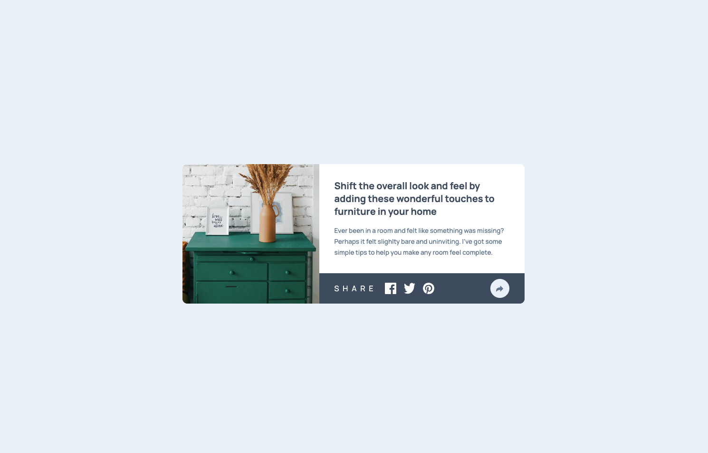
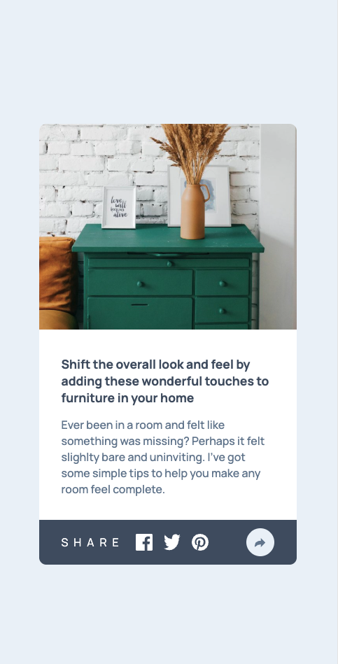

# Frontend Mentor - Article preview component solution

This is a solution to the [Article preview component challenge on Frontend Mentor](https://www.frontendmentor.io/challenges/article-preview-component-dYBN_pYFT). Frontend Mentor challenges help you improve your coding skills by building realistic projects. 

## Table of contents

- [Overview](#overview)
  - [The challenge](#the-challenge)
  - [Screenshot](#screenshot)
  - [Links](#links)
- [My process](#my-process)
  - [Built with](#built-with)
- [Author](#author)

## Overview

### The challenge

Users should be able to:

- View the optimal layout for the component depending on their device's screen size
- See the social media share links when they click the share icon

### Screenshot
#### Desktop Screenshot

#### Mobile Screenshot

### Links

- Solution URL: [Github Repo](https://github.com/dilaraj/Article-Preview-Master-Component)
- Live Site URL: [Github Pages](https://dilaraj.github.io/Article-Preview-Master-Component/)

## My process

### Built with

- CSS custom properties
- Flexbox
- Mobile-first workflow
- [React](https://reactjs.org/) - JS library

## Author

- LinkedIn - [Dilara](www.linkedin.com/in/dilara-ajaj8122024)
- Github - [@dilaraj](https://github.com/dilaraj)